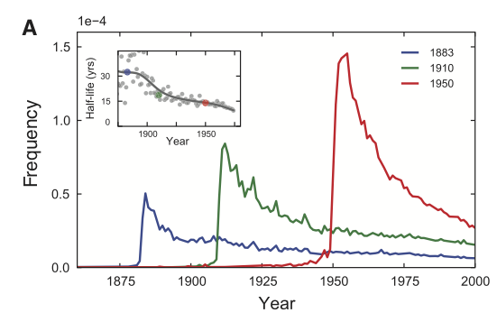
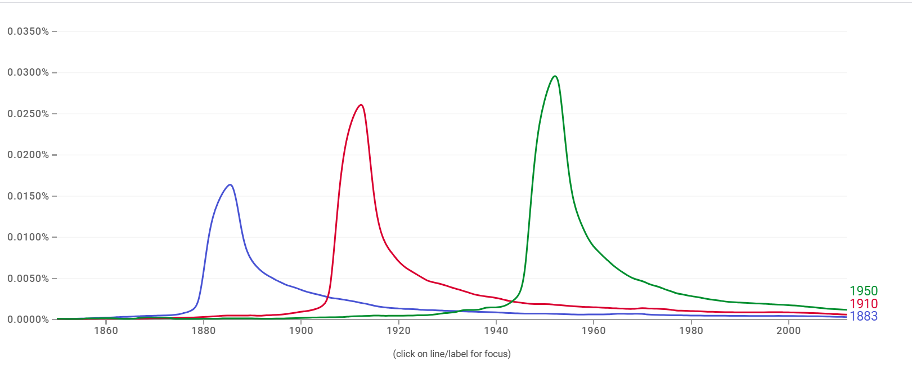

```{r setup, include=FALSE}
library(here)
library(scales)
library(tidyverse)

theme_set(theme_bw())

knitr::opts_chunk$set(echo = TRUE)
```

# Description

This is a template for exercise 6 in Chapter 2 of [Bit By Bit: Social Research in the Digital Age](https://www.bitbybitbook.com/en/1st-ed/observing-behavior/observing-activities/) by Matt Salganik. The problem is reprinted here with some additional comments and structure to facilitate a solution.

The original problem statement:

> In a widely discussed paper, Michel and colleagues ([2011](https://doi.org/10.1126/science.1199644)) analyzed the content of more than five million digitized books in an attempt to identify long-term cultural trends. The data that they used has now been released as the Google NGrams dataset, and so we can use the data to replicate and extend some of their work.
>
> In one of the many results in the paper, Michel and colleagues argued that we are forgetting faster and faster. For a particular year, say “1883,” they calculated the proportion of 1-grams published in each year between 1875 and 1975 that were “1883”. They reasoned that this proportion is a measure of the interest in events that happened in that year. In their figure 3a, they plotted the usage trajectories for three years: 1883, 1910, and 1950. These three years share a common pattern: little use before that year, then a spike, then decay. Next, to quantify the rate of decay for each year, Michel and colleagues calculated the “half-life” of each year for all years between 1875 and 1975. In their figure 3a (inset), they showed that the half-life of each year is decreasing, and they argued that this means that we are forgetting the past faster and faster. They used Version 1 of the English language corpus, but subsequently Google has released a second version of the corpus. Please read all the parts of the question before you begin coding.
>
> This activity will give you practice writing reusable code, interpreting results, and data wrangling (such as working with awkward files and handling missing data). This activity will also help you get up and running with a rich and interesting dataset.

The full paper can be found [here](https://aidenlab.org/papers/Science.Culturomics.pdf), and this is the original figure 3a that you're going to replicate:

> 

# Part A

> Get the raw data from the [Google Books NGram Viewer website](http://storage.googleapis.com/books/ngrams/books/datasetsv2.html). In particular, you should use version 2 of the English language corpus, which was released on July 1, 2012. Uncompressed, this file is 1.4GB.

## Get and clean the raw data

Edit the `01_download_1grams.sh` file to download the `googlebooks-eng-all-1gram-20120701-1.gz` file and the `02_filter_1grams.sh` file to filter the original 1gram file to only lines where the ngram matches a year (output to a file named `year_counts.tsv`).

Then edit the `03_download_totals.sh` file to down the `googlebooks-eng-all-totalcounts-20120701.txt` and  file and the `04_reformat_totals.sh` file to reformat the total counts file to a valid csv (output to a file named `total_counts.csv`). 

## Load the cleaned data

Load in the `year_counts.tsv` and `total_counts.csv` files. Use the `here()` function around the filename to keep things portable.Give the columns of `year_counts.tsv` the names `term`, `year`, `volume`, and `book_count`. Give the columns of `total_counts.csv` the names `year`, `total_volume`, `page_count`, and `book_count`. Note that column order in these files may not match the examples in the documentation.

```{r load-counts}
year_counts <- read_tsv(
  here("week3/ngrams","year_counts.tsv"), 
  col_names=c("term", "year", "volume", "book_count"))

total_counts <- read_csv(
  here("week3/ngrams","total_counts.csv"), 
  col_names=c("year", "total_volume", "page_count", "book_count"))
```

## Your written answer

Add a line below using Rmarkdown's inline syntax to print the total number of lines in each dataframe you've created.

There are `r nrow(year_counts)` rows in year_counts & `r nrow(total_counts)` in total_counts.

# Part B

> Recreate the main part of figure 3a of Michel et al. (2011). To recreate this figure, you will need two files: 
> the one you downloaded in part (a) and the “total counts” file, which you can use to convert the raw counts 
> into proportions. Note that the total counts file has a structure that may make it a bit hard to read in. 
> Does version 2 of the NGram data produce similar results to those presented in Michel et al. (2011), which are 
> based on version 1 data?

## Join ngram year counts and totals

Join the raw year term counts with the total counts and divide to get a proportion of mentions for each term normalized 
by the total counts for each year.

```{r join-years-and-totals}
proportion_counts <- left_join(year_counts, select(total_counts, total_volume, year), by="year") %>%
  mutate(proportion=volume/total_volume)

proportion_counts
```

## Plot the main figure 3a

Plot the proportion of mentions for the terms "1883", "1910", and "1950" over time from 1850 to 2012, as in the main 
figure 3a of the original paper. Use the `percent` function from the `scales` package for a readable y axis. Each 
term should have a different color, it's nice if these match the original paper but not strictly necessary.

```{r plot-proportion-over-time}
proportion_df <- proportion_counts %>% 
  filter(year>=1850 & year<=2012) %>%
  filter(grepl('1883|1910|1950',term)) %>%
  mutate(term = as.character(term))

proportion_df %>%
  ggplot(aes(x=year,y=proportion, group=term, color=term)) +
    geom_line() +
    scale_y_continuous(labels=percent) +
    labs(x="Year",y="Frequency")
```

## Your written answer

It does produce similar results to those based on version 1 of the data, the frequencies follow a similar pattern
visually. However, the actual percentages do vary between this version and the older version. 


# Part C

> Now check your graph against the graph created by the [NGram Viewer](https://books.google.com/ngrams/).

## Compare to the NGram Viewer

Go to the ngram viewer, enter the terms "1883", "1910", and "1950" and take a screenshot.

## Your written answer

Add your screenshot for Part C below this line using the `` syntax and comment on similarities / differences.

Follows a similar trend, with 1883 having the lowest peak and 1950 having the highest. The actual % values are different though.
Moreover, my figure shows the differences in % to be more dramatic than the NGram Viewer does. 


# Part D

> Recreate figure 3a (main figure), but change the y-axis to be the raw mention count (not the rate of mentions).

## Plot the main figure 3a with raw counts

Plot the raw counts for the terms "1883", "1910", and "1950" over time from 1850 to 2012. Use the `comma` function 
from the `scales` package for a readable y axis. The colors for each term should match your last plot, and it's nice 
if these match the original paper but not strictly necessary.

```{r plot-raw-mentions-over-time}
proportion_df %>% #already filtered for terms & years
  ggplot(aes(x=year,y=volume, group=term, color=term)) +
    geom_line() +
    scale_y_continuous(labels=comma) +
    labs(x="Year",y="Raw Mentions")
```

# Part E

> Does the difference between (b) and (d) lead you to reevaluate any of the results of Michel et al. (2011). Why or why not?

As part of answering this question, make an additional plot.

## Plot the totals

Plot the total counts for each year over time, from 1850 to 2012. Use the `comma` function from the `scales` package for a 
readable y axis. There should be only one line on this plot (not three).

```{r plot-totals}
proportion_counts %>% 
  filter(year>=1850 & year<=2012) %>%
  ggplot(aes(x=year,y=total_volume)) +
    geom_line() +
    scale_y_continuous(labels=comma) +
    labs(x="Year",y="Total Counts")
```

## Your written answer

The paper suggets that we are forgetting things quicker, but looking at this visual makes you consider the fact 
that the volume of ngrams in the corpus has largely increased over time. Thus, ngrams will count as a lower proportion
of the total volume. So while you could say that the years aren't getting mentioned as much in terms of comparison to the 
rest of the corpus, the increasing volume would be a reason for that. But the actual count of mentions doesn't seem to 
be disappearing in the same way.

# Part F

> Now, using the proportion of mentions, replicate the inset of figure 3a. That is, for each year between 1875 and 1975, 
> calculate the half-life of that year. The half-life is defined to be the number of years that pass before the proportion 
> of mentions reaches half its peak value. Note that Michel et al. (2011) do something more complicated to estimate the 
> half-life—see section III.6 of the Supporting Online Information—but they claim that both approaches produce similar 
> results. Does version 2 of the NGram data produce similar results to those presented in Michel et al. (2011), which 
> are based on version 1 data? (Hint: Don’t be surprised if it doesn’t.)

## Compute peak mentions

For each year term, find the year where its proportion of mentions peaks (hits its highest value). Store this in an 
intermediate dataframe.

```{r compute-peaks}
peak_df <- proportion_counts %>%
  filter(year >= 1875 & year <= 1975) %>%
  group_by(term) %>%
  slice_max(proportion)
```


## Compute half-lifes

Now, for each year term, find the minimum number of years it takes for the proportion of mentions to decline from its peak 
value to half its peak value. Store this in an intermediate data frame.

```{r compute-half-lifes}
halflife_df <- proportion_counts %>%
  filter(term >= 1875, term <= 1975, year >= 1850, year <= 2012) %>%
  left_join(select(peak_df,term,year,proportion),by="term") %>%
  filter(year.x >= year.y) %>%
  filter(proportion.x <= proportion.y/2) %>%
  group_by(term) %>%
  slice_min(year.x) %>%
  rename(halflife_year=year.x,halflife_prop=proportion.x,peak_year=year.y,peak_prop=proportion.y) %>%
  select(term,halflife_year,halflife_prop,peak_year,peak_prop) %>%
  mutate(years_btwn=halflife_year-peak_year)
```

## Plot the inset of figure 3a

Plot the half-life of each term over time from 1850 to 2012. Each point should represent one year term, and add 
a line to show the trend using `geom_smooth()`.


```{r plot-half-lifes}
halflife_df %>%
  ggplot(aes(x=term,y=years_btwn)) +
    geom_point() +
    geom_smooth() +
    labs(x="Year",y="Half-life (yrs)")
```

## Your written answer

This graph does not produce similar results to those presented in the paper. While the paper shows a somewhat steady
decline in half-life over time, this data shows (mostly) an upward trend with a little variation. This could indicate
differences between versions 1 and 2 of the data, or the methods used to produce the half-life plot.

# Part G

> Were there any years that were outliers such as years that were forgotten particularly quickly or particularly slowly? 
> Briefly speculate about possible reasons for that pattern and explain how you identified the outliers.

## Your written answer

Write up your answer to Part G here. Include code that shows the years with the smallest and largest half-lifes.
```{r}
halflife_df %>%
  arrange(years_btwn)
```
```{r}
halflife_df %>%
  arrange(desc(years_btwn))
```

The years with the shortest halflifes were 1877, 1878, and 1942. I was surprised at 1942 since it is during WWII, but
potentially theres a case where it isn't directly mentioned but instead mentioned as part of the range of years of
WWII. Unsure about 1877 & 1878 having short half lifes, potentially less influential events occuring?

The years with the longest halflifes were 1975, 1900, 1910. Assuming 1900/1910 are relevant as the turn of the century
& pre WWI era. 1975 is post Watergate/Nixon resignation, wondering if that has something to do with the longevity of
its half-life. 

On the surface, I would assume that halflifes have to do with historic/cultural events, but I think theres more nuance
to it based on the years showing up with the shortest/longest halflifes. 

# Makefile

Edit the `Makefile` in this directory to execute the full set of scripts that download the data, clean it, and produce 
this report. This must be turned in with your assignment such that running `make` on the command line produces the final 
report as a pdf file.
